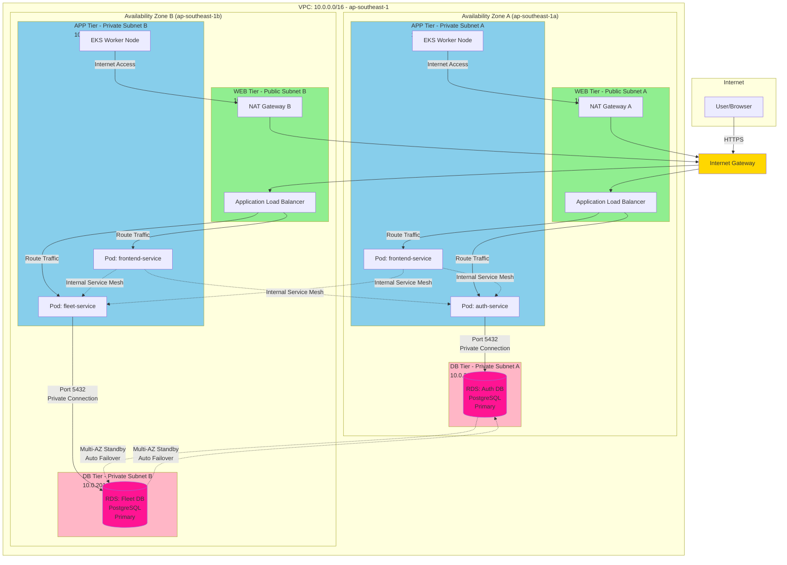

```mermaid
graph TB
    subgraph Internet
        User[User/Browser]
    end
    
    IGW[Internet Gateway]
    
    subgraph VPC["VPC: 10.0.0.0/16 - ap-southeast-1"]
        
        subgraph AZ-A["Availability Zone A (ap-southeast-1a)"]
            subgraph WebA["WEB Tier - Public Subnet A<br/>10.0.100.0/24"]
                ALBA[Application Load Balancer]
                NATA[NAT Gateway A]
            end
            
            subgraph AppA["APP Tier - Private Subnet A<br/>10.0.0.0/24"]
                EKSA[EKS Worker Node]
                FrontendA[Pod: frontend-service]
                AuthA[Pod: auth-service]
            end
            
            subgraph DBA["DB Tier - Private Subnet A<br/>10.0.200.0/24"]
                AuthDBA[(RDS: Auth DB<br/>PostgreSQL<br/>Primary)]
            end
        end
        
        subgraph AZ-B["Availability Zone B (ap-southeast-1b)"]
            subgraph WebB["WEB Tier - Public Subnet B<br/>10.0.101.0/24"]
                ALBB[Application Load Balancer]
                NATB[NAT Gateway B]
            end
            
            subgraph AppB["APP Tier - Private Subnet B<br/>10.0.1.0/24"]
                EKSB[EKS Worker Node]
                FrontendB[Pod: frontend-service]
                FleetB[Pod: fleet-service]
            end
            
            subgraph DBB["DB Tier - Private Subnet B<br/>10.0.201.0/24"]
                FleetDBB[(RDS: Fleet DB<br/>PostgreSQL<br/>Primary)]
            end
        end
    end
    
    User -->|HTTPS| IGW
    IGW --> ALBA
    IGW --> ALBB
    
    ALBA -->|Route Traffic| FrontendA
    ALBA -->|Route Traffic| AuthA
    ALBB -->|Route Traffic| FrontendB
    ALBB -->|Route Traffic| FleetB
    
    EKSA -->|Internet Access| NATA
    EKSB -->|Internet Access| NATB
    NATA --> IGW
    NATB --> IGW
    
    FrontendA -.->|Internal Service Mesh| AuthA
    FrontendA -.->|Internal Service Mesh| FleetB
    FrontendB -.->|Internal Service Mesh| AuthA
    FrontendB -.->|Internal Service Mesh| FleetB
    
    AuthA -->|Port 5432<br/>Private Connection| AuthDBA
    FleetB -->|Port 5432<br/>Private Connection| FleetDBB
    
    AuthDBA -.->|Multi-AZ Standby<br/>Auto Failover| FleetDBB
    FleetDBB -.->|Multi-AZ Standby<br/>Auto Failover| AuthDBA
    
    style WebA fill:#90EE90
    style WebB fill:#90EE90
    style AppA fill:#87CEEB
    style AppB fill:#87CEEB
    style DBA fill:#FFB6C6
    style DBB fill:#FFB6C6
    style IGW fill:#FFD700
    style AuthDBA fill:#FF1493
    style FleetDBB fill:#FF1493
```