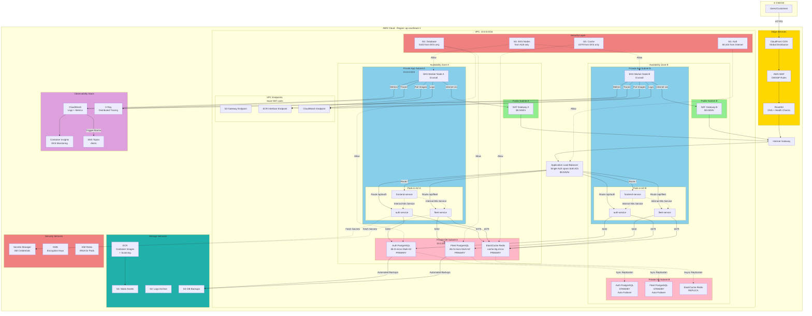

```mermaid
graph TB
    subgraph Internet["🌐 Internet"]
        Users[Users/Customers]
    end
    
    subgraph AWS["AWS Cloud - Region: ap-southeast-1"]
        subgraph Edge["Edge Services"]
            CF[CloudFront CDN<br/>Global Distribution]
            R53[Route53<br/>DNS + Health Checks]
            WAF[AWS WAF<br/>OWASP Rules]
        end
        
        IGW[Internet Gateway]
        
        subgraph VPC["VPC: 10.0.0.0/16"]
            
            subgraph AZ-A["Availability Zone A"]
                subgraph PubA["Public Subnet A<br/>10.0.100.0/24"]
                    NATA[NAT Gateway A<br/>$0.045/hr]
                end
                
                subgraph AppA["Private App Subnet A<br/>10.0.0.0/24"]
                    EKSA[EKS Worker Node A<br/>t3.small]
                    
                    subgraph PodsA["Pods in AZ-A"]
                        FrontA[frontend-service]
                        AuthA[auth-service]
                        FleetA[fleet-service]
                    end
                end
                
                subgraph DBA["Private DB Subnet A<br/>10.0.200.0/24"]
                    AuthDB[Auth PostgreSQL<br/>db.t3.micro Multi-AZ<br/>PRIMARY]
                    FleetDB[Fleet PostgreSQL<br/>db.t3.micro Multi-AZ<br/>PRIMARY]
                    Redis[ElastiCache Redis<br/>cache.t4g.micro<br/>PRIMARY]
                end
            end
            
            subgraph AZ-B["Availability Zone B"]
                subgraph PubB["Public Subnet B<br/>10.0.101.0/24"]
                    NATB[NAT Gateway B<br/>$0.045/hr]
                end
                
                subgraph AppB["Private App Subnet B<br/>10.0.1.0/24"]
                    EKSB[EKS Worker Node B<br/>t3.small]
                    
                    subgraph PodsB["Pods in AZ-B"]
                        FrontB[frontend-service]
                        AuthB[auth-service]
                        FleetB[fleet-service]
                    end
                end
                
                subgraph DBB["Private DB Subnet B<br/>10.0.201.0/24"]
                    AuthDBStandby[Auth PostgreSQL<br/>STANDBY<br/>Auto-Failover]
                    FleetDBStandby[Fleet PostgreSQL<br/>STANDBY<br/>Auto-Failover]
                    RedisReplica[ElastiCache Redis<br/>REPLICA]
                end
            end
            
            ALB[Application Load Balancer<br/>Single ALB spans both AZs<br/>$0.025/hr]
            
            subgraph VPCEndpoints["VPC Endpoints<br/>Save NAT costs"]
                S3EP[S3 Gateway Endpoint]
                ECREP[ECR Interface Endpoint]
                CWEP[CloudWatch Endpoint]
            end
            
            subgraph Security["Security Layer"]
                SG-ALB[SG: ALB<br/>80,443 from Internet]
                SG-EKS[SG: EKS Nodes<br/>from ALB only]
                SG-DB[SG: Database<br/>5432 from EKS only]
                SG-Cache[SG: Cache<br/>6379 from EKS only]
            end
        end
        
        subgraph Monitoring["Observability Stack"]
            CW[CloudWatch<br/>Logs + Metrics]
            CI[Container Insights<br/>EKS Monitoring]
            XRay[X-Ray<br/>Distributed Tracing]
            SNS[SNS Topics<br/>Alerts]
        end
        
        subgraph Storage["Storage Services"]
            ECR[ECR<br/>Container Images<br/>+ Scanning]
            S3Assets[S3: Static Assets]
            S3Logs[S3: Logs Archive]
            S3Backup[S3: DB Backups]
        end
        
        subgraph Security2["Security Services"]
            SM[Secrets Manager<br/>DB Credentials]
            KMS[KMS<br/>Encryption Keys]
            IAM[IAM Roles<br/>IRSA for Pods]
        end
    end
    
    Users -->|HTTPS| CF
    CF --> WAF
    WAF --> R53
    R53 --> IGW
    IGW --> ALB
    
    ALB -->|Route /api/auth| AuthA
    ALB -->|Route /api/auth| AuthB
    ALB -->|Route /api/fleet| FleetA
    ALB -->|Route /api/fleet| FleetB
    ALB -->|Route /| FrontA
    ALB -->|Route /| FrontB
    
    FrontA -.->|Internal K8s Service| AuthA
    FrontA -.->|Internal K8s Service| FleetA
    FrontB -.->|Internal K8s Service| AuthB
    FrontB -.->|Internal K8s Service| FleetB
    
    AuthA -->|5432| AuthDB
    AuthB -->|5432| AuthDB
    FleetA -->|5432| FleetDB
    FleetB -->|5432| FleetDB
    
    AuthA -->|6379| Redis
    AuthB -->|6379| Redis
    FleetA -->|6379| Redis
    FleetB -->|6379| Redis
    
    AuthDB -.->|Sync Replication| AuthDBStandby
    FleetDB -.->|Sync Replication| FleetDBStandby
    Redis -.->|Async Replication| RedisReplica
    
    EKSA -->|Internet via| NATA
    EKSB -->|Internet via| NATB
    NATA --> IGW
    NATB --> IGW
    
    EKSA -->|Pull Images| ECREP
    EKSB -->|Pull Images| ECREP
    EKSA -->|Logs| CWEP
    EKSB -->|Logs| CWEP
    
    ECR --> S3Assets
    AuthDB -->|Automated Backups| S3Backup
    FleetDB -->|Automated Backups| S3Backup
    
    EKSA -->|Metrics| CW
    EKSB -->|Metrics| CW
    CW --> CI
    EKSA -->|Traces| XRay
    EKSB -->|Traces| XRay
    
    CW -->|Trigger Alarms| SNS
    
    AuthA -.->|Fetch Secrets| SM
    FleetA -.->|Fetch Secrets| SM
    
    SG-ALB -.->|Allow| ALB
    SG-EKS -.->|Allow| EKSA
    SG-EKS -.->|Allow| EKSB
    SG-DB -.->|Allow| AuthDB
    SG-DB -.->|Allow| FleetDB
    SG-Cache -.->|Allow| Redis
    
    style PubA fill:#90EE90
    style PubB fill:#90EE90
    style AppA fill:#87CEEB
    style AppB fill:#87CEEB
    style DBA fill:#FFB6C6
    style DBB fill:#FFB6C6
    style Edge fill:#FFD700
    style Monitoring fill:#DDA0DD
    style Security fill:#F08080
    style Security2 fill:#F08080
    style Storage fill:#20B2AA
```