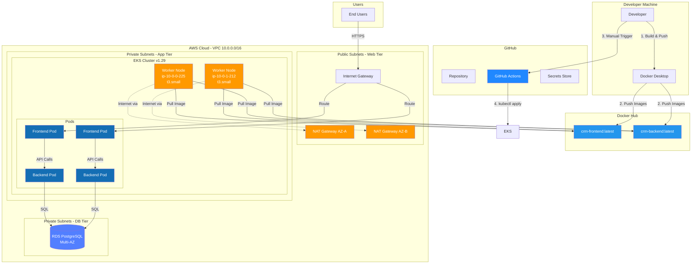

```mermaid
graph TB
    subgraph "Developer Machine"
        DEV[Developer]
        DOCKER[Docker Desktop]
    end
    
    subgraph "Docker Hub"
        FE_IMAGE[crm-frontend:latest]
        BE_IMAGE[crm-backend:latest]
    end
    
    subgraph "GitHub"
        REPO[Repository]
        ACTIONS[GitHub Actions]
        SECRETS[Secrets Store]
    end
    
    subgraph "AWS Cloud - VPC 10.0.0.0/16"
        subgraph "Public Subnets - Web Tier"
            IGW[Internet Gateway]
            NAT1[NAT Gateway AZ-A]
            NAT2[NAT Gateway AZ-B]
        end
        
        subgraph "Private Subnets - App Tier"
            subgraph "EKS Cluster v1.29"
                NODE1[Worker Node<br/>ip-10-0-0-225<br/>t3.small]
                NODE2[Worker Node<br/>ip-10-0-1-212<br/>t3.small]
                
                subgraph "Pods"
                    FE_POD1[Frontend Pod]
                    FE_POD2[Frontend Pod]
                    BE_POD1[Backend Pod]
                    BE_POD2[Backend Pod]
                end
            end
        end
        
        subgraph "Private Subnets - DB Tier"
            DB[(RDS PostgreSQL<br/>Multi-AZ)]
        end
    end
    
    subgraph "Users"
        USER[End Users]
    end
    
    DEV -->|1. Build & Push| DOCKER
    DOCKER -->|2. Push Images| FE_IMAGE
    DOCKER -->|2. Push Images| BE_IMAGE
    
    DEV -->|3. Manual Trigger| ACTIONS
    ACTIONS -->|4. kubectl apply| EKS
    
    NODE1 -->|Pull Image| FE_IMAGE
    NODE1 -->|Pull Image| BE_IMAGE
    NODE2 -->|Pull Image| FE_IMAGE
    NODE2 -->|Pull Image| BE_IMAGE
    
    USER -->|HTTPS| IGW
    IGW -->|Route| FE_POD1
    IGW -->|Route| FE_POD2
    
    FE_POD1 -->|API Calls| BE_POD1
    FE_POD2 -->|API Calls| BE_POD2
    BE_POD1 -->|SQL| DB
    BE_POD2 -->|SQL| DB
    
    NODE1 -.->|Internet via| NAT1
    NODE2 -.->|Internet via| NAT2
    
    style NODE1 fill:#ff9900,color:#fff
    style NODE2 fill:#ff9900,color:#fff
    style FE_POD1 fill:#146eb4,color:#fff
    style FE_POD2 fill:#146eb4,color:#fff
    style BE_POD1 fill:#146eb4,color:#fff
    style BE_POD2 fill:#146eb4,color:#fff
    style DB fill:#527fff,color:#fff
    style NAT1 fill:#ff9900,color:#fff
    style NAT2 fill:#ff9900,color:#fff
    style FE_IMAGE fill:#2496ed,color:#fff
    style BE_IMAGE fill:#2496ed,color:#fff
    style ACTIONS fill:#2088ff,color:#fff
```