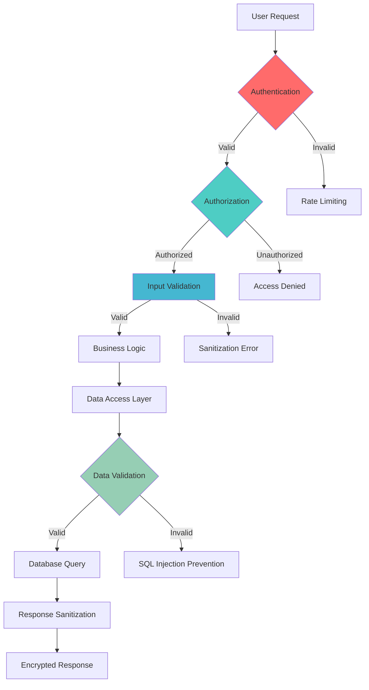

# Security & Performance Best Practices

## 🎯 Overview

This document establishes comprehensive security and performance standards for XploreSG that demonstrate academic excellence in secure software development, performance optimization, and industry best practices. Our approach ensures robust security posture while maintaining optimal application performance across all deployment environments.

## 🔒 Security Excellence Framework

### Security-by-Design Principles

- **Zero Trust Architecture**: Verify every request, encrypt all data, assume breach scenarios
- **Defense in Depth**: Multiple layers of security controls and monitoring
- **Principle of Least Privilege**: Minimal access rights for users and systems
- **Security Automation**: Continuous security testing and monitoring
- **Incident Response**: Prepared response procedures for security events

### Threat Modeling & Risk Assessment



## 🛡️ Authentication & Authorization

### JWT Implementation Best Practices

```typescript
// lib/auth/jwt.service.ts
import jwt from "jsonwebtoken";
import crypto from "crypto";
import { User } from "../types/user.types";

interface TokenPayload {
  sub: string;
  email: string;
  roles: string[];
  iat: number;
  exp: number;
  jti: string; // JWT ID for tracking
}

interface TokenPair {
  accessToken: string;
  refreshToken: string;
  expiresIn: number;
}

export class JwtService {
  private readonly accessTokenSecret: string;
  private readonly refreshTokenSecret: string;
  private readonly accessTokenExpiry = "15m";
  private readonly refreshTokenExpiry = "7d";

  constructor() {
    this.accessTokenSecret = this.getSecretOrThrow("JWT_ACCESS_SECRET");
    this.refreshTokenSecret = this.getSecretOrThrow("JWT_REFRESH_SECRET");
  }

  /**
   * Generate secure token pair with proper expiration and tracking
   */
  async generateTokenPair(user: User): Promise<TokenPair> {
    const jti = crypto.randomUUID();
    const now = Math.floor(Date.now() / 1000);

    const payload: TokenPayload = {
      sub: user.id,
      email: user.email,
      roles: user.roles,
      iat: now,
      exp: now + this.parseExpiry(this.accessTokenExpiry),
      jti,
    };

    // Generate access token
    const accessToken = jwt.sign(payload, this.accessTokenSecret, {
      algorithm: "HS256",
      expiresIn: this.accessTokenExpiry,
      issuer: "xploresg-api",
      audience: "xploresg-client",
    });

    // Generate refresh token (longer expiry, different secret)
    const refreshToken = jwt.sign(
      {
        sub: user.id,
        jti,
        type: "refresh",
        iat: now,
      },
      this.refreshTokenSecret,
      {
        algorithm: "HS256",
        expiresIn: this.refreshTokenExpiry,
        issuer: "xploresg-api",
      }
    );

    // Store JWT ID for revocation tracking
    await this.storeJwtId(user.id, jti);

    return {
      accessToken,
      refreshToken,
      expiresIn: this.parseExpiry(this.accessTokenExpiry),
    };
  }

  /**
   * Verify and decode JWT with comprehensive validation
   */
  async verifyAccessToken(token: string): Promise<TokenPayload> {
    try {
      const decoded = jwt.verify(token, this.accessTokenSecret, {
        algorithms: ["HS256"],
        issuer: "xploresg-api",
        audience: "xploresg-client",
      }) as TokenPayload;

      // Check if token is blacklisted
      const isRevoked = await this.isTokenRevoked(decoded.jti);
      if (isRevoked) {
        throw new Error("Token has been revoked");
      }

      return decoded;
    } catch (error) {
      if (error instanceof jwt.TokenExpiredError) {
        throw new Error("Access token has expired");
      }
      if (error instanceof jwt.JsonWebTokenError) {
        throw new Error("Invalid access token");
      }
      throw error;
    }
  }

  /**
   * Refresh access token using refresh token
   */
  async refreshAccessToken(refreshToken: string): Promise<TokenPair> {
    try {
      const decoded = jwt.verify(refreshToken, this.refreshTokenSecret) as any;

      if (decoded.type !== "refresh") {
        throw new Error("Invalid refresh token type");
      }

      // Get user and generate new token pair
      const user = await this.getUserById(decoded.sub);
      if (!user) {
        throw new Error("User not found");
      }

      // Revoke old token
      await this.revokeToken(decoded.jti);

      return this.generateTokenPair(user);
    } catch (error) {
      throw new Error("Invalid refresh token");
    }
  }

  /**
   * Revoke token by adding to blacklist
   */
  async revokeToken(jti: string): Promise<void> {
    await this.blacklistToken(jti);
  }

  private getSecretOrThrow(envVar: string): string {
    const secret = process.env[envVar];
    if (!secret) {
      throw new Error(`${envVar} environment variable is required`);
    }
    if (secret.length < 32) {
      throw new Error(`${envVar} must be at least 32 characters long`);
    }
    return secret;
  }

  private parseExpiry(expiry: string): number {
    // Convert string expiry to seconds
    const match = expiry.match(/^(\d+)([smhd])$/);
    if (!match) throw new Error("Invalid expiry format");

    const value = parseInt(match[1]);
    const unit = match[2];

    switch (unit) {
      case "s":
        return value;
      case "m":
        return value * 60;
      case "h":
        return value * 3600;
      case "d":
        return value * 86400;
      default:
        throw new Error("Invalid expiry unit");
    }
  }

  private async storeJwtId(userId: string, jti: string): Promise<void> {
    // Store in Redis or database for tracking
    await redis.setex(`jwt:${jti}`, 3600 * 24 * 7, userId);
  }

  private async isTokenRevoked(jti: string): Promise<boolean> {
    const exists = await redis.exists(`jwt:revoked:${jti}`);
    return exists === 1;
  }

  private async blacklistToken(jti: string): Promise<void> {
    await redis.setex(`jwt:revoked:${jti}`, 3600 * 24 * 7, "true");
  }
}
```

### Multi-Factor Authentication (MFA)

```typescript
// lib/auth/mfa.service.ts
import speakeasy from "speakeasy";
import qrcode from "qrcode";
import crypto from "crypto";

export class MfaService {
  /**
   * Generate TOTP secret for user
   */
  async generateTotpSecret(user: User): Promise<{
    secret: string;
    qrCodeUrl: string;
    backupCodes: string[];
  }> {
    const secret = speakeasy.generateSecret({
      name: `XploreSG (${user.email})`,
      issuer: "XploreSG",
      length: 32,
    });

    const qrCodeUrl = await qrcode.toDataURL(secret.otpauth_url!);
    const backupCodes = this.generateBackupCodes();

    // Store secret and backup codes encrypted in database
    await this.storeMfaSecret(user.id, secret.base32, backupCodes);

    return {
      secret: secret.base32,
      qrCodeUrl,
      backupCodes,
    };
  }

  /**
   * Verify TOTP token
   */
  async verifyTotp(userId: string, token: string): Promise<boolean> {
    const secret = await this.getMfaSecret(userId);
    if (!secret) {
      throw new Error("MFA not configured for user");
    }

    const verified = speakeasy.totp.verify({
      secret,
      encoding: "base32",
      token,
      window: 2, // Allow 2 steps (60 seconds) of tolerance
    });

    if (verified) {
      // Log successful MFA verification
      await this.logMfaEvent(userId, "totp_success");
    } else {
      // Log failed attempt
      await this.logMfaEvent(userId, "totp_failed");
    }

    return verified;
  }

  /**
   * Verify backup code
   */
  async verifyBackupCode(userId: string, code: string): Promise<boolean> {
    const backupCodes = await this.getBackupCodes(userId);
    const hashedCode = this.hashBackupCode(code);

    const isValid = backupCodes.includes(hashedCode);

    if (isValid) {
      // Remove used backup code
      await this.removeBackupCode(userId, hashedCode);
      await this.logMfaEvent(userId, "backup_code_used");
    }

    return isValid;
  }

  private generateBackupCodes(): string[] {
    return Array.from({ length: 8 }, () =>
      crypto.randomBytes(5).toString("hex").toUpperCase()
    );
  }

  private hashBackupCode(code: string): string {
    return crypto.createHash("sha256").update(code).digest("hex");
  }

  private async storeMfaSecret(
    userId: string,
    secret: string,
    backupCodes: string[]
  ): Promise<void> {
    const hashedBackupCodes = backupCodes.map((code) =>
      this.hashBackupCode(code)
    );

    await userRepository.update(userId, {
      mfaSecret: this.encrypt(secret),
      mfaBackupCodes: hashedBackupCodes,
      mfaEnabled: false, // Enabled after first successful verification
    });
  }

  private encrypt(text: string): string {
    const key = process.env.MFA_ENCRYPTION_KEY!;
    const iv = crypto.randomBytes(16);
    const cipher = crypto.createCipher("aes-256-gcm", key);

    let encrypted = cipher.update(text, "utf8", "hex");
    encrypted += cipher.final("hex");

    return iv.toString("hex") + ":" + encrypted;
  }
}
```

## 🚫 Input Validation & Sanitization

### Comprehensive Input Validation

```typescript
// lib/validation/input-validator.ts
import { z } from "zod";
import DOMPurify from "isomorphic-dompurify";
import validator from "validator";

// Custom Zod schemas for Singapore-specific validation
const singaporePhoneSchema = z.string().refine((phone) => {
  // Singapore phone number validation
  const cleanPhone = phone.replace(/\s+/g, "");
  return /^(\+65)?[689]\d{7}$/.test(cleanPhone);
}, "Please provide a valid Singapore phone number");

const singaporePostalCodeSchema = z.string().refine((postal) => {
  return /^\d{6}$/.test(postal);
}, "Please provide a valid Singapore postal code");

// User registration validation schema
export const createUserSchema = z.object({
  email: z
    .string()
    .email("Invalid email format")
    .max(255, "Email too long")
    .transform((email) => email.toLowerCase().trim())
    .refine(async (email) => {
      // Check email against disposable email providers
      const isDisposable = await this.isDisposableEmail(email);
      return !isDisposable;
    }, "Disposable email addresses are not allowed"),

  password: z
    .string()
    .min(8, "Password must be at least 8 characters")
    .max(128, "Password too long")
    .refine((password) => {
      // Strong password requirements
      const hasUpper = /[A-Z]/.test(password);
      const hasLower = /[a-z]/.test(password);
      const hasNumber = /\d/.test(password);
      const hasSpecial = /[!@#$%^&*()_+\-=\[\]{};':"\\|,.<>\/?]/.test(password);

      return hasUpper && hasLower && hasNumber && hasSpecial;
    }, "Password must contain uppercase, lowercase, number, and special character"),

  firstName: z
    .string()
    .min(1, "First name required")
    .max(50, "First name too long")
    .transform((name) => this.sanitizeName(name))
    .refine(
      (name) => /^[a-zA-Z\s'-]+$/.test(name),
      "Invalid characters in first name"
    ),

  lastName: z
    .string()
    .min(1, "Last name required")
    .max(50, "Last name too long")
    .transform((name) => this.sanitizeName(name))
    .refine(
      (name) => /^[a-zA-Z\s'-]+$/.test(name),
      "Invalid characters in last name"
    ),

  phoneNumber: singaporePhoneSchema.optional(),

  bio: z
    .string()
    .max(500, "Bio too long")
    .transform((bio) => this.sanitizeHtml(bio))
    .optional(),

  dateOfBirth: z
    .date()
    .refine((date) => {
      const age = new Date().getFullYear() - date.getFullYear();
      return age >= 13 && age <= 120;
    }, "Must be between 13 and 120 years old")
    .optional(),
});

// Location creation validation schema
export const createLocationSchema = z.object({
  name: z
    .string()
    .min(1, "Location name required")
    .max(100, "Location name too long")
    .transform((name) => this.sanitizeText(name)),

  description: z
    .string()
    .min(10, "Description must be at least 10 characters")
    .max(2000, "Description too long")
    .transform((desc) => this.sanitizeHtml(desc)),

  category: z.enum(
    [
      "restaurant",
      "attraction",
      "hotel",
      "shopping",
      "nightlife",
      "transport",
      "culture",
      "nature",
    ],
    "Invalid category"
  ),

  latitude: z
    .number()
    .min(1.16, "Invalid Singapore latitude")
    .max(1.48, "Invalid Singapore latitude"),

  longitude: z
    .number()
    .min(103.6, "Invalid Singapore longitude")
    .max(104.0, "Invalid Singapore longitude"),

  address: z
    .string()
    .min(5, "Address too short")
    .max(200, "Address too long")
    .transform((addr) => this.sanitizeText(addr)),

  postalCode: singaporePostalCodeSchema.optional(),

  tags: z
    .array(z.string().max(20))
    .max(10, "Too many tags")
    .transform((tags) =>
      tags.map((tag) => this.sanitizeText(tag.toLowerCase()))
    ),

  images: z
    .array(
      z.object({
        url: z.string().url("Invalid image URL"),
        alt: z.string().max(100, "Alt text too long"),
        caption: z.string().max(200, "Caption too long").optional(),
      })
    )
    .max(5, "Maximum 5 images allowed"),
});

export class InputValidator {
  /**
   * Sanitize HTML content while preserving safe formatting
   */
  private sanitizeHtml(html: string): string {
    return DOMPurify.sanitize(html, {
      ALLOWED_TAGS: ["p", "br", "strong", "em", "u", "a"],
      ALLOWED_ATTR: ["href", "title"],
      ALLOWED_URI_REGEXP: /^https?:\/\/[^\s/$.?#].[^\s]*$/i,
    });
  }

  /**
   * Sanitize plain text input
   */
  private sanitizeText(text: string): string {
    return validator.escape(text.trim());
  }

  /**
   * Sanitize name fields
   */
  private sanitizeName(name: string): string {
    return name
      .trim()
      .replace(/\s+/g, " ") // Multiple spaces to single space
      .replace(/[^\p{L}\s'-]/gu, ""); // Remove non-letter characters except spaces, hyphens, apostrophes
  }

  /**
   * Check if email is from a disposable email provider
   */
  private async isDisposableEmail(email: string): Promise<boolean> {
    const domain = email.split("@")[1];

    // Check against known disposable email domains
    const disposableDomains = await this.getDisposableEmailDomains();
    return disposableDomains.includes(domain.toLowerCase());
  }

  /**
   * Validate file upload
   */
  static validateFileUpload(file: Express.Multer.File): void {
    const allowedMimes = ["image/jpeg", "image/png", "image/webp", "image/gif"];

    const maxSize = 5 * 1024 * 1024; // 5MB

    if (!allowedMimes.includes(file.mimetype)) {
      throw new Error(
        "Invalid file type. Only JPEG, PNG, WebP, and GIF are allowed."
      );
    }

    if (file.size > maxSize) {
      throw new Error("File size too large. Maximum size is 5MB.");
    }

    // Check file signature (magic numbers) to prevent MIME type spoofing
    const fileSignature = file.buffer.slice(0, 4).toString("hex");
    const validSignatures = {
      ffd8ffe0: "jpeg",
      ffd8ffe1: "jpeg",
      ffd8ffe2: "jpeg",
      "89504e47": "png",
      "52494646": "webp",
      "47494638": "gif",
    };

    const detectedType = Object.keys(validSignatures).find((sig) =>
      fileSignature.startsWith(sig)
    );

    if (!detectedType) {
      throw new Error("Invalid file format detected.");
    }
  }
}
```

## 🔐 SQL Injection Prevention

### Parameterized Queries with Prisma

```typescript
// lib/database/location.repository.ts
import { PrismaClient, Location, Prisma } from "@prisma/client";

export class LocationRepository {
  constructor(private prisma: PrismaClient) {}

  /**
   * Safe location search with parameterized queries
   */
  async searchLocations(params: {
    query?: string;
    category?: string;
    latitude?: number;
    longitude?: number;
    radius?: number;
    limit?: number;
    offset?: number;
  }): Promise<Location[]> {
    const {
      query,
      category,
      latitude,
      longitude,
      radius = 5000, // 5km default
      limit = 20,
      offset = 0,
    } = params;

    // Build WHERE clause safely
    const where: Prisma.LocationWhereInput = {
      status: "active",
      ...(category && { category }),
      ...(query && {
        OR: [
          { name: { contains: query, mode: "insensitive" } },
          { description: { contains: query, mode: "insensitive" } },
          { tags: { hasSome: [query.toLowerCase()] } },
        ],
      }),
    };

    // Add geospatial filtering if coordinates provided
    if (latitude && longitude) {
      // Use PostGIS functions through raw SQL with parameters
      const locations = await this.prisma.$queryRaw<Location[]>`
        SELECT l.*, 
               ST_Distance_Sphere(
                 ST_MakePoint(l.longitude, l.latitude),
                 ST_MakePoint(${longitude}, ${latitude})
               ) as distance
        FROM locations l
        WHERE l.status = 'active'
          AND (${category} IS NULL OR l.category = ${category})
          AND (${query} IS NULL OR 
               l.name ILIKE ${"%" + (query || "") + "%"} OR
               l.description ILIKE ${"%" + (query || "") + "%"})
          AND ST_Distance_Sphere(
                ST_MakePoint(l.longitude, l.latitude),
                ST_MakePoint(${longitude}, ${latitude})
              ) <= ${radius}
        ORDER BY distance ASC
        LIMIT ${limit} OFFSET ${offset}
      `;

      return locations;
    }

    // Standard Prisma query for non-geospatial searches
    return this.prisma.location.findMany({
      where,
      take: limit,
      skip: offset,
      orderBy: { createdAt: "desc" },
    });
  }

  /**
   * Safe user review retrieval with proper access control
   */
  async getUserReviews(
    userId: string,
    requestingUserId: string,
    limit = 10,
    offset = 0
  ): Promise<Review[]> {
    // Check if requesting user can view these reviews
    if (userId !== requestingUserId) {
      const targetUser = await this.prisma.user.findUnique({
        where: { id: userId },
        select: { profileVisibility: true, blockedUsers: true },
      });

      if (!targetUser) {
        throw new Error("User not found");
      }

      if (
        targetUser.profileVisibility === "private" ||
        targetUser.blockedUsers.some(
          (blocked) => blocked.blockedUserId === requestingUserId
        )
      ) {
        throw new Error("Access denied");
      }
    }

    return this.prisma.review.findMany({
      where: {
        authorId: userId,
        status: "published",
      },
      include: {
        location: {
          select: {
            id: true,
            name: true,
            category: true,
          },
        },
      },
      take: limit,
      skip: offset,
      orderBy: { createdAt: "desc" },
    });
  }
}
```

## 🚀 Performance Optimization

### Database Query Optimization

```typescript
// lib/performance/database-optimizer.ts
export class DatabaseOptimizer {
  /**
   * Implement efficient pagination with cursor-based approach
   */
  async getCursorPaginatedLocations(params: {
    cursor?: string;
    limit: number;
    category?: string;
  }): Promise<{
    locations: Location[];
    nextCursor?: string;
    hasMore: boolean;
  }> {
    const { cursor, limit, category } = params;

    const where: Prisma.LocationWhereInput = {
      status: "active",
      ...(category && { category }),
      ...(cursor && {
        id: {
          gt: cursor, // Greater than cursor for next page
        },
      }),
    };

    const locations = await this.prisma.location.findMany({
      where,
      take: limit + 1, // Take one extra to check if there are more
      orderBy: { id: "asc" },
      include: {
        _count: {
          select: {
            reviews: true,
            favorites: true,
          },
        },
        reviews: {
          take: 1,
          orderBy: { createdAt: "desc" },
          select: {
            rating: true,
          },
        },
      },
    });

    const hasMore = locations.length > limit;
    const resultLocations = hasMore ? locations.slice(0, -1) : locations;
    const nextCursor = hasMore
      ? resultLocations[resultLocations.length - 1].id
      : undefined;

    return {
      locations: resultLocations,
      nextCursor,
      hasMore,
    };
  }

  /**
   * Batch data loading to prevent N+1 queries
   */
  async getLocationsWithReviewStats(locationIds: string[]): Promise<
    Map<
      string,
      {
        averageRating: number;
        reviewCount: number;
        recentReviews: Review[];
      }
    >
  > {
    // Single query to get all review stats
    const reviewStats = await this.prisma.review.groupBy({
      by: ["locationId"],
      where: {
        locationId: { in: locationIds },
        status: "published",
      },
      _avg: {
        rating: true,
      },
      _count: {
        id: true,
      },
    });

    // Single query to get recent reviews for all locations
    const recentReviews = await this.prisma.review.findMany({
      where: {
        locationId: { in: locationIds },
        status: "published",
      },
      take: locationIds.length * 3, // 3 recent reviews per location
      orderBy: { createdAt: "desc" },
      include: {
        author: {
          select: {
            id: true,
            profile: {
              select: {
                displayName: true,
                avatar: true,
              },
            },
          },
        },
      },
    });

    // Build result map
    const resultMap = new Map();

    for (const locationId of locationIds) {
      const stats = reviewStats.find((s) => s.locationId === locationId);
      const reviews = recentReviews
        .filter((r) => r.locationId === locationId)
        .slice(0, 3);

      resultMap.set(locationId, {
        averageRating: stats?._avg.rating || 0,
        reviewCount: stats?._count.id || 0,
        recentReviews: reviews,
      });
    }

    return resultMap;
  }
}
```

### Caching Strategy Implementation

```typescript
// lib/cache/redis-cache.service.ts
import Redis from "ioredis";
import { z } from "zod";

export class CacheService {
  private redis: Redis;
  private defaultTTL = 3600; // 1 hour

  constructor() {
    this.redis = new Redis(process.env.REDIS_URL!);
  }

  /**
   * Multi-level caching with compression for large objects
   */
  async get<T>(key: string, schema?: z.ZodSchema<T>): Promise<T | null> {
    try {
      const cached = await this.redis.get(key);
      if (!cached) return null;

      // Check if data is compressed
      let data: string;
      if (cached.startsWith("gzip:")) {
        data = await this.decompress(cached.slice(5));
      } else {
        data = cached;
      }

      const parsed = JSON.parse(data);

      // Validate against schema if provided
      if (schema) {
        return schema.parse(parsed);
      }

      return parsed;
    } catch (error) {
      console.error(`Cache get error for key ${key}:`, error);
      return null;
    }
  }

  /**
   * Set cache with automatic compression for large objects
   */
  async set(
    key: string,
    value: any,
    ttl: number = this.defaultTTL
  ): Promise<void> {
    try {
      const serialized = JSON.stringify(value);

      // Compress if data is large (>1KB)
      let dataToStore: string;
      if (serialized.length > 1024) {
        const compressed = await this.compress(serialized);
        dataToStore = `gzip:${compressed}`;
      } else {
        dataToStore = serialized;
      }

      await this.redis.setex(key, ttl, dataToStore);
    } catch (error) {
      console.error(`Cache set error for key ${key}:`, error);
    }
  }

  /**
   * Distributed cache-aside pattern implementation
   */
  async getOrSet<T>(
    key: string,
    fetcher: () => Promise<T>,
    ttl: number = this.defaultTTL,
    schema?: z.ZodSchema<T>
  ): Promise<T> {
    // Try to get from cache first
    const cached = await this.get(key, schema);
    if (cached !== null) {
      return cached;
    }

    // Use distributed lock to prevent cache stampede
    const lockKey = `lock:${key}`;
    const lockValue = Math.random().toString(36);
    const lockAcquired = await this.redis.set(
      lockKey,
      lockValue,
      "PX",
      5000,
      "NX"
    );

    if (lockAcquired) {
      try {
        // Double-check cache after acquiring lock
        const doubleCheck = await this.get(key, schema);
        if (doubleCheck !== null) {
          return doubleCheck;
        }

        // Fetch fresh data
        const freshData = await fetcher();

        // Cache the result
        await this.set(key, freshData, ttl);

        return freshData;
      } finally {
        // Release lock
        await this.redis.eval(
          `
          if redis.call("get", KEYS[1]) == ARGV[1] then
            return redis.call("del", KEYS[1])
          else
            return 0
          end
        `,
          1,
          lockKey,
          lockValue
        );
      }
    } else {
      // Lock not acquired, wait briefly and retry cache
      await new Promise((resolve) => setTimeout(resolve, 100));
      const retryCache = await this.get(key, schema);
      if (retryCache !== null) {
        return retryCache;
      }

      // Fallback: fetch without caching
      return fetcher();
    }
  }

  /**
   * Cache invalidation with pattern matching
   */
  async invalidatePattern(pattern: string): Promise<void> {
    const keys = await this.redis.keys(pattern);
    if (keys.length > 0) {
      await this.redis.del(...keys);
    }
  }

  /**
   * Batch operations for efficiency
   */
  async mget<T>(
    keys: string[],
    schema?: z.ZodSchema<T>
  ): Promise<Map<string, T>> {
    const values = await this.redis.mget(...keys);
    const result = new Map<string, T>();

    for (let i = 0; i < keys.length; i++) {
      const value = values[i];
      if (value) {
        try {
          const parsed = JSON.parse(value);
          const validated = schema ? schema.parse(parsed) : parsed;
          result.set(keys[i], validated);
        } catch (error) {
          console.error(
            `Error parsing cached value for key ${keys[i]}:`,
            error
          );
        }
      }
    }

    return result;
  }

  private async compress(data: string): Promise<string> {
    const zlib = await import("zlib");
    return new Promise((resolve, reject) => {
      zlib.gzip(Buffer.from(data), (err, compressed) => {
        if (err) reject(err);
        else resolve(compressed.toString("base64"));
      });
    });
  }

  private async decompress(data: string): Promise<string> {
    const zlib = await import("zlib");
    return new Promise((resolve, reject) => {
      zlib.gunzip(Buffer.from(data, "base64"), (err, decompressed) => {
        if (err) reject(err);
        else resolve(decompressed.toString());
      });
    });
  }
}
```

### Frontend Performance Optimization

```typescript
// lib/performance/frontend-optimizer.tsx
import { memo, useMemo, useCallback, lazy, Suspense } from "react";
import { useVirtualizer } from "@tanstack/react-virtual";
import Image from "next/image";

// Lazy load heavy components
const LocationMap = lazy(() => import("../components/LocationMap"));
const LocationReviews = lazy(() => import("../components/LocationReviews"));

/**
 * Optimized location list with virtualization
 */
export const OptimizedLocationList = memo<{
  locations: Location[];
  onLocationSelect: (location: Location) => void;
}>(({ locations, onLocationSelect }) => {
  const parentRef = useRef<HTMLDivElement>(null);

  // Virtualize large lists
  const virtualizer = useVirtualizer({
    count: locations.length,
    getScrollElement: () => parentRef.current,
    estimateSize: () => 200, // Estimated item height
    overscan: 5, // Render 5 items outside viewport
  });

  const handleLocationSelect = useCallback(
    (location: Location) => {
      onLocationSelect(location);
    },
    [onLocationSelect]
  );

  return (
    <div ref={parentRef} className="h-96 overflow-auto">
      <div
        style={{
          height: `${virtualizer.getTotalSize()}px`,
          width: "100%",
          position: "relative",
        }}
      >
        {virtualizer.getVirtualItems().map((virtualItem) => {
          const location = locations[virtualItem.index];
          return (
            <LocationCard
              key={location.id}
              location={location}
              style={{
                position: "absolute",
                top: 0,
                left: 0,
                width: "100%",
                height: `${virtualItem.size}px`,
                transform: `translateY(${virtualItem.start}px)`,
              }}
              onSelect={handleLocationSelect}
            />
          );
        })}
      </div>
    </div>
  );
});

/**
 * Optimized image component with progressive loading
 */
export const OptimizedImage = memo<{
  src: string;
  alt: string;
  width: number;
  height: number;
  priority?: boolean;
  className?: string;
}>(({ src, alt, width, height, priority = false, className }) => {
  const [isLoading, setIsLoading] = useState(true);
  const [error, setError] = useState(false);

  const handleLoad = useCallback(() => {
    setIsLoading(false);
  }, []);

  const handleError = useCallback(() => {
    setError(true);
    setIsLoading(false);
  }, []);

  if (error) {
    return (
      <div
        className={`bg-gray-200 flex items-center justify-center ${className}`}
        style={{ width, height }}
      >
        <span className="text-gray-500">Image unavailable</span>
      </div>
    );
  }

  return (
    <div className={`relative ${className}`}>
      {isLoading && (
        <div
          className="absolute inset-0 bg-gray-200 animate-pulse flex items-center justify-center"
          style={{ width, height }}
        >
          <div className="w-8 h-8 border-2 border-gray-300 border-t-blue-500 rounded-full animate-spin" />
        </div>
      )}
      <Image
        src={src}
        alt={alt}
        width={width}
        height={height}
        priority={priority}
        onLoad={handleLoad}
        onError={handleError}
        className={`transition-opacity duration-300 ${
          isLoading ? "opacity-0" : "opacity-100"
        }`}
        sizes="(max-width: 768px) 100vw, (max-width: 1200px) 50vw, 33vw"
      />
    </div>
  );
});

/**
 * Search with debouncing and memoization
 */
export const OptimizedSearch = memo<{
  onSearch: (query: string) => void;
  debounceMs?: number;
}>(({ onSearch, debounceMs = 300 }) => {
  const [query, setQuery] = useState("");

  // Debounce search queries
  const debouncedSearch = useMemo(
    () =>
      debounce((searchQuery: string) => {
        onSearch(searchQuery);
      }, debounceMs),
    [onSearch, debounceMs]
  );

  const handleInputChange = useCallback(
    (e: React.ChangeEvent<HTMLInputElement>) => {
      const value = e.target.value;
      setQuery(value);
      debouncedSearch(value);
    },
    [debouncedSearch]
  );

  return (
    <input
      type="search"
      value={query}
      onChange={handleInputChange}
      placeholder="Search locations..."
      className="w-full px-4 py-2 border rounded-lg focus:ring-2 focus:ring-blue-500"
    />
  );
});

// Utility function for debouncing
function debounce<T extends (...args: any[]) => void>(
  func: T,
  wait: number
): (...args: Parameters<T>) => void {
  let timeout: NodeJS.Timeout;

  return (...args: Parameters<T>) => {
    clearTimeout(timeout);
    timeout = setTimeout(() => func(...args), wait);
  };
}
```

## 🔍 Monitoring & Security Auditing

### Security Event Monitoring

```typescript
// lib/security/security-monitor.ts
export class SecurityMonitor {
  private eventLog = new EventLogger();

  /**
   * Monitor and log security events
   */
  async logSecurityEvent(event: {
    type:
      | "login_attempt"
      | "password_change"
      | "mfa_enabled"
      | "suspicious_activity"
      | "data_access";
    userId?: string;
    ipAddress: string;
    userAgent: string;
    success: boolean;
    metadata?: Record<string, any>;
  }): Promise<void> {
    const logEntry = {
      ...event,
      timestamp: new Date().toISOString(),
      severity: this.calculateSeverity(event),
    };

    // Log to security audit trail
    await this.eventLog.log("security", logEntry);

    // Alert on suspicious activity
    if (this.isSuspiciousActivity(event)) {
      await this.sendSecurityAlert(logEntry);
    }
  }

  /**
   * Rate limiting implementation
   */
  async checkRateLimit(
    key: string,
    limit: number,
    windowMs: number
  ): Promise<{ allowed: boolean; remaining: number; resetTime: Date }> {
    const now = Date.now();
    const window = Math.floor(now / windowMs);
    const redisKey = `rate_limit:${key}:${window}`;

    const current = await redis.incr(redisKey);

    if (current === 1) {
      await redis.expire(redisKey, Math.ceil(windowMs / 1000));
    }

    const allowed = current <= limit;
    const remaining = Math.max(0, limit - current);
    const resetTime = new Date((window + 1) * windowMs);

    if (!allowed) {
      await this.logSecurityEvent({
        type: "suspicious_activity",
        ipAddress: key,
        userAgent: "Unknown",
        success: false,
        metadata: { rateLimitExceeded: true, attempts: current },
      });
    }

    return { allowed, remaining, resetTime };
  }

  private calculateSeverity(
    event: any
  ): "low" | "medium" | "high" | "critical" {
    if (event.type === "suspicious_activity") return "high";
    if (event.type === "login_attempt" && !event.success) return "medium";
    return "low";
  }

  private isSuspiciousActivity(event: any): boolean {
    return (
      event.type === "suspicious_activity" ||
      (event.type === "login_attempt" && !event.success)
    );
  }
}
```

This comprehensive security and performance guide establishes enterprise-grade standards that demonstrate academic proficiency while ensuring robust protection and optimal performance for the XploreSG application.
